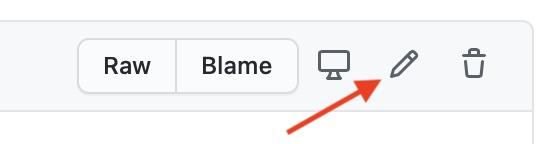
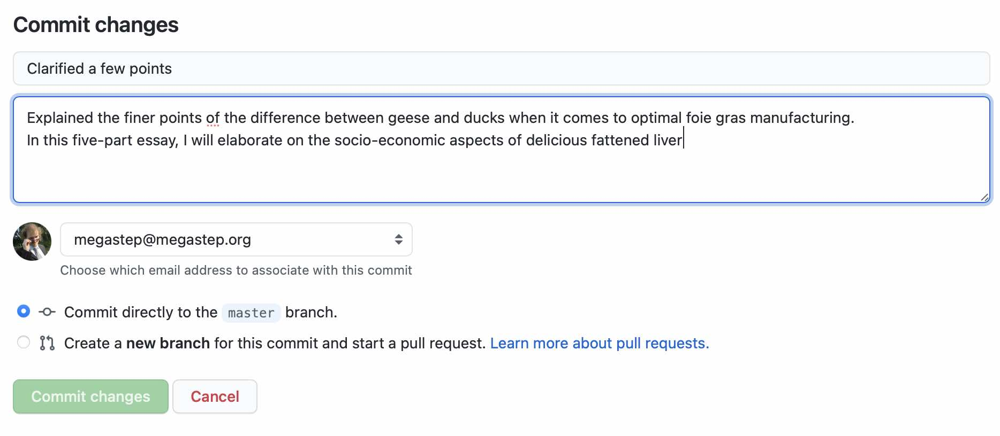

# Updating Your Website

## The Basics

Most content on the website is written in [Markdown](https://en.wikipedia.org/wiki/Markdown), a very simple markup language that is a lot easier to handle than HTML. 
You can learn the basics with [this online guide](https://www.markdownguide.org/basic-syntax/), though it should be fairly self-explanatory when editing existing code.

You can do edits through GitHub's built-in Web editor. Click on the link below for the page you want to edit, then click the pen icon to start editing.

* [Welcome Message](https://github.com/megastep/adamhillerlaw.com/blob/master/_includes/welcome.md)
* [About](https://github.com/megastep/adamhillerlaw.com/blob/master/about.md)
* [Community](https://github.com/megastep/adamhillerlaw.com/blob/master/community.md)
* [Links](https://github.com/megastep/adamhillerlaw.com/blob/master/links.md)
* [Mediation](https://github.com/megastep/adamhillerlaw.com/blob/master/mediation.md)
* [Privacy Policy](https://github.com/megastep/adamhillerlaw.com/blob/master/privacy.md)
* [Terms of Service](https://github.com/megastep/adamhillerlaw.com/blob/master/terms.md)

For most of those files, the first few lines (between `---` lines) are metadata about the page, such as the title and its path on the site. The actual page content starts after that block.

## About editing code on GitHub

Your site is split into `master` and `dev` branches. Changes made to the master branch get rendered to your website immediately. You probably expect that behavior, and the links above will send you to the master branch.

Do not worry about the dev branch - we mostly use it for iterations of development and periodically merge our changes back to the master branch when they are ready for publication.

When making changes, you can preview what they will look like with the `Preview changes` tab in the editor, though note that you will only see the general styling from the raw text, not the way the styles are rendered on the final site. But this can be a quick check that your Markdown syntax is behaving as expected.

Whenever you edit a file, you need to create a "commit" for your changes. This is done by just filling in details in the form at the bottom of the editor. 

Just describe what you did (it will help see the history of changes over time) and submit, and it should become live within a minute or so after GitHub regenerates the site. You can give it a one-liner description as well as an extended description if you want.

## More advanced edits

Besides the Markdown pages above, there are a few more advanced files that contain text for the template. If this looks intimidating, just reach out to us.

This template uses YAML files to describe additional structure, in the following files:

* [Navigation](https://github.com/megastep/adamhillerlaw.com/blob/master/_data/navigation.yml)
* [Site Text](https://github.com/megastep/adamhillerlaw.com/blob/master/_data/sitetext.yml)
* [Jekyll Configuration](https://github.com/megastep/adamhillerlaw.com/blob/master/_config.yml)

This is more technically involved so please reach out to us in case of any doubt, particularly if it's for anything more complicated than a simple text change.

