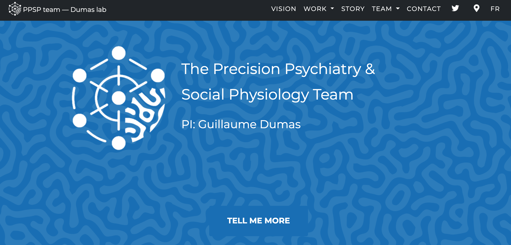

The Jekyll structure of this theme includes:

- `_papers` files - what generate the papers grid. YAML front matter handles all the details
- the `page` layout allows custom pages, as seen in the legal and 404 pages
- `sitetext.yml` enables complete customization of all site text
- `navigation.yml` enables fully customizable navigation
- `style.yml` enables fully customizable colors, background images, and other style-related things

[template]: https://github.com/raviriley/agency-jekyll-theme-starter

<!--
## Documentation and Usage

**TODO:** Write usage instructions here. Describe available layouts, includes, or assets.

navheader is used only for the home page. nav is used everywhere else.

Layouts:

Includes:

-->

## Development

To set up your environment and develop this website:
1. [Clone this repo](https://github.com/ppsp-team/ppsp-team.github.io.git)
2. Run `bundle install`
3. Launch the server `bundle exec jekyll serve` 
4. Access your local server at `http://localhost:4000` or at `http://127.0.0.1:4000/`

<!-- ## Add pages/Big changes (create a remote branch, make changes, merge request)
## Add a paper (open file, copy-paste example) -->

## License

The theme is available as open source under the terms of the [MIT License](https://opensource.org/licenses/MIT).

<!--

## Example Implementations

- [CV Enterprises](https://cventerprises.org)
- [Mortazavi Lab at UC Irvine](https://mortazavilab.github.io/)

-->
